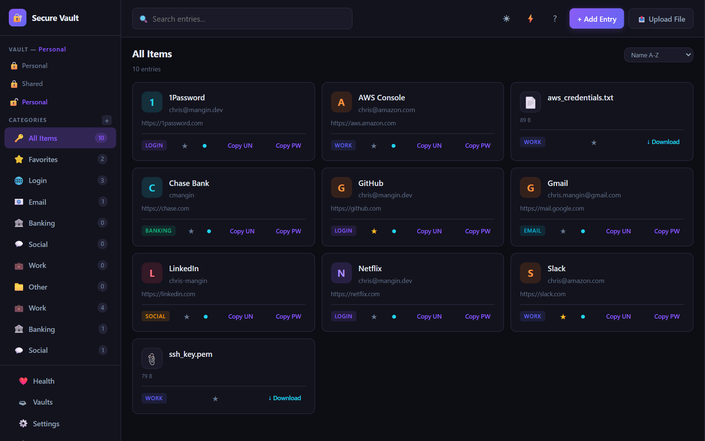
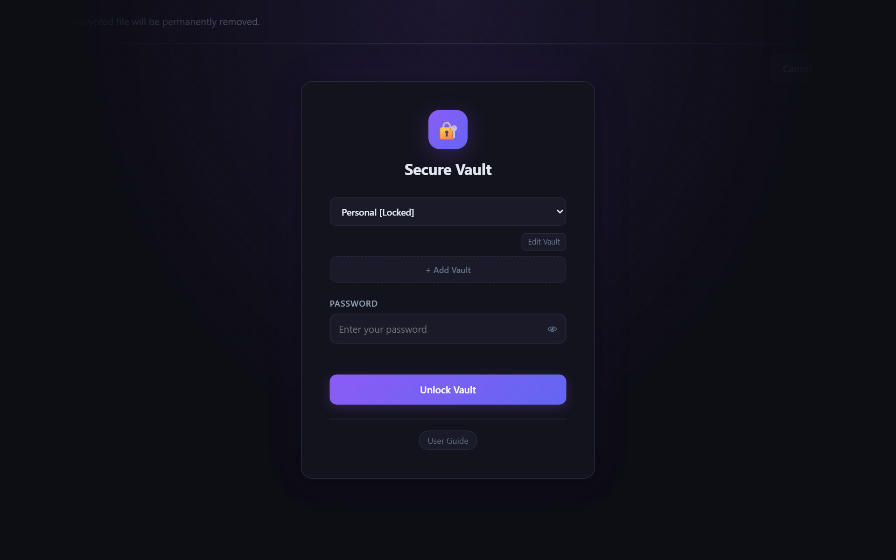
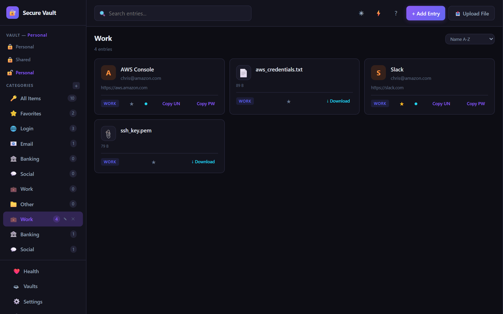
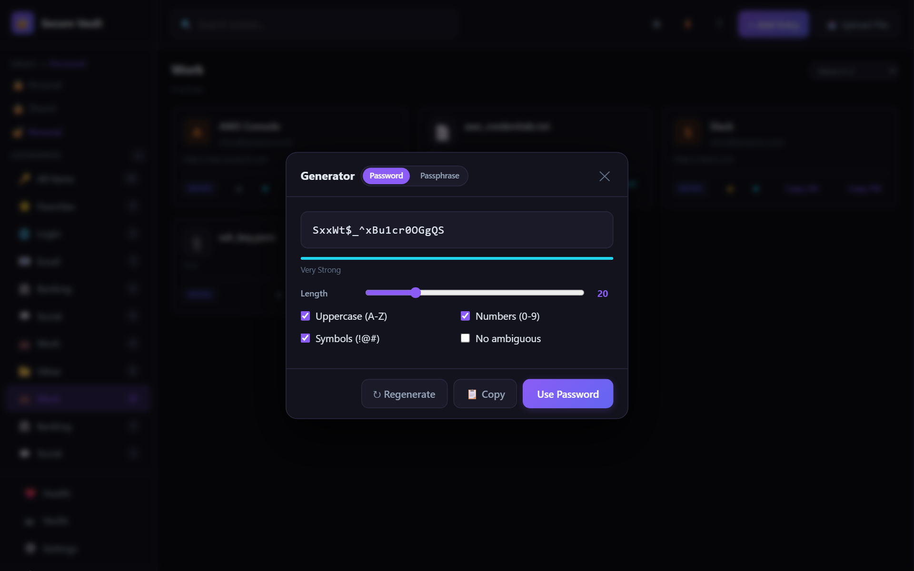

<div align="center">

# Secure Vault
**Local encrypted vault for passwords and files — no cloud, no accounts, no telemetry**

[](https://github.com/ChrisMangin/secure-vault)
[](https://github.com/ChrisMangin/secure-vault)
[](https://github.com/ChrisMangin/secure-vault/releases/latest)
[](LICENSE)

<br>

</div>

Secure Vault is a **standalone Windows app** (single ~3 MB exe, no installer) that stores passwords, secure notes, and encrypted files in an AES-256-GCM encrypted vault on your local machine. Everything runs over localhost — nothing leaves your computer.


## Screenshots

<table>
<tr>
  <td></td>
  <td></td>
</tr>
<tr>
  <td align="center"><em>Entries grid with strength indicators and quick-copy</em></td>
  <td align="center"><em>Unlock screen with multi-vault support</em></td>
</tr>
<tr>
  <td></td>
  <td></td>
</tr>
<tr>
  <td align="center"><em>Encrypted files stored alongside passwords by category</em></td>
  <td align="center"><em>Password and passphrase generator with strength meter</em></td>
</tr>
</table>


## Features

### Passwords & Credentials
- **AES-256-GCM** encryption with **Argon2id** key derivation (t=3, m=65536, p=4)
- Unlimited vaults — local file or shared network path
- Categories with custom icons and colors
- Password strength scoring on every card + health dashboard (weak, reused, expiring)
- Password history (last 5 per entry), TOTP/2FA code generation built into entries
- Password generator — random characters or passphrase (3–8 words, custom separator)
- Import: CSV (generic, LastPass), Bitwarden JSON — Export: CSV, JSON
- Vault merge (combine two vaults, skip duplicates)
- Breach check via Have I Been Pwned (k-anonymity — password never sent in full)

### Encrypted Files
- Files stored as entries **inside the vault** alongside passwords — one file to back up
- Organized by category: store certs, keys, PDFs, and passwords together in "Work", "Home", etc.
- Upload via topbar button; download decrypts in memory — nothing plaintext on disk
- Edit file name, category, notes, and favorite flag without touching the encrypted content
- File type icons auto-detected (images, PDFs, archives, documents, code, etc.)

### Security
- **Two-factor authentication**: TOTP (authenticator app), Email OTP, WebAuthn (hardware key)
- Backup codes, PIN quick-unlock, configurable auto-lock (5 min – never)
- Activity log per session; shared vault file locking for safe concurrent network access
- Server binds to `127.0.0.1` only — not reachable from other machines

### App
- Single **`Vault.exe`** — no installer, no dependencies, no CMD window
- Auto-quits ~10 seconds after closing the browser tab (heartbeat watchdog)
- Duplicate instance detection — second launch opens the existing session in your browser
- Light / dark mode, custom accent color, keyboard shortcuts throughout


## Quick Start

### Option 1 — Standalone EXE (no Rust needed)

1. Download **`Vault.exe`** from the [latest release](https://github.com/ChrisMangin/secure-vault/releases/latest)
2. Double-click it — your default browser opens to `http://127.0.0.1:7474`
3. Click **Add Vault**, choose a save location and master password
4. Use **Quit** in the sidebar to exit, or just close the tab (auto-quits in ~10s)

### Option 2 — Build from Source

**Prerequisites:** [Rust](https://rustup.rs/) stable toolchain

```bash
git clone https://github.com/ChrisMangin/secure-vault
cd secure-vault
cargo build --release
# Output: target/release/Vault.exe
```


## Vault File Format

All data lives in a single JSON file:

```json
{
  "version": 2,
  "salt":       "<base64 Argon2id salt>",
  "nonce":      "<base64 AES-GCM nonce>",
  "ciphertext": "<base64 encrypted payload>"
}
```

The decrypted payload contains `entries` (passwords + files), `categories`, and `settings` — including any uploaded file data — all encrypted together as one blob.


## Keyboard Shortcuts

| Shortcut | Action |
|---|---|
| `Ctrl+N` | New entry |
| `Ctrl+F` | Focus search |
| `Ctrl+G` | Open password generator |
| `Escape` | Close panel / modal |
| `?` | Open user guide |


## License

[MIT](LICENSE)
